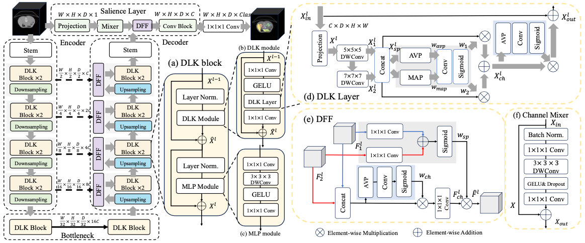

The official repo for the manuscript "D-Net: Dynamic Large Kernel with Dynamic Feature Fusion for Volumetric Medical Image Segmentation". [Arxiv](https://arxiv.org/abs/2403.10674)

Abstract
=======
Hierarchical Vision Transformers (ViTs) have achieved significant success in medical image segmen- tation due to their large receptive field and ability to leverage long-range contextual information. Convolutional neural networks (CNNs) may also deliver a large receptive field by using large convolutional kernels. However, because they use fixed-sized kernels, CNNs with large kernels remain limited in their ability to adaptively capture multi-scale features from organs that vary greatly in shape and size. They are also unable to utilize global contextual information efficiently. To address these limitations, we propose lightweight Dynamic Large Kernel (DLK) and Dynamic Feature Fusion (DFF) modules. The DLK employs multiple large kernels with varying kernel sizes and dilation rates to capture multi-scale features. Subsequently, DLK utilizes a dynamic selection mechanism to adaptively highlight the most important channel and spatial features based on global information. The DFF is proposed to adaptively fuse multi-scale local feature maps based on their global information. We incorporated DLK and DFF into a hierarchical ViT architecture to leverage their scaling behavior, but they struggle to extract low-level features effectively due to feature embedding constraints in ViT architectures. To tackle this limitation, we propose a Salience layer to extract low-level features from images at their original dimensions without feature embedding. This Salience layer employs a Channel Mixer to capture global representations effectively. We further incorporated the Salience layer into the hierarchical ViT architecture to develop a novel network, termed D-Net. D-Net effectively utilizes a multi-scale large receptive field and adaptively harnesses global contextual information. Extensive experimental results demonstrate its superior segmentation performance compared to state-of-the-art models, with comparably lower computational complexity.

Methods
=======



Citation
=======
If you use D-net in your research, please consider to cite our work.

```
@article{yang2024d,
  title={D-Net: Dynamic Large Kernel with Dynamic Feature Fusion for Volumetric Medical Image Segmentation},
  author={Yang, Jin and Qiu, Peijie and Zhang, Yichi and Marcus, Daniel S and Sotiras, Aristeidis},
  journal={arXiv preprint arXiv:2403.10674},
  year={2024}
}
```


Question
=======
If you have any questions about our work, please contact us via email (yang.jin@wustl.edu).
